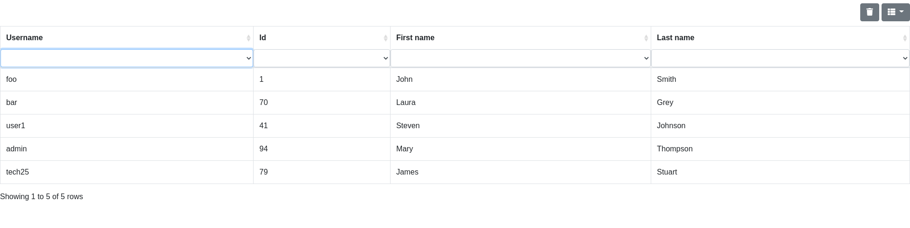

# csv2dynhtml

A script using pandoc and python (beautifulsoup) to transform csv input into dynamic html table (using bootstrap tables and html)

## Usage

- Put this files in your path:

   - csv2dynthml
   - csv2dynhtml-pandoc-template
   - csv2dynhtml-transform.py

- transform your csv input:

    ```
    $ csv2dynhtml examples/username.csv
    ```

- Open in your broswer

    ```
    $ xdg-open username.html
    ```

    

- It accepts stdin so you can pipe your input to it

    ```
    $ sed 's/;/,/g' examples/non-standard-username.csv | csv2dynhtml
    ```

## Details

- It uses pandoc to convert csv to html
- csv2dynhtml-pandoc-template.html is used to include bootstrap-table css and javascript into html
- csv2dynhtml-transform.py is used to add metadata to HTML table and table headers tags to sort and filter table data

## Credits:

- Bootstrap tables: https://bootstrap-table.com/
- pandoc: https://pandoc.org/
- beautifulsoup: https://www.crummy.com/software/BeautifulSoup/
 
